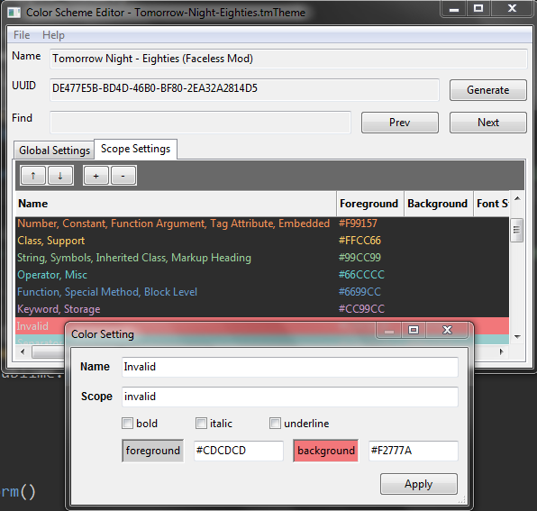
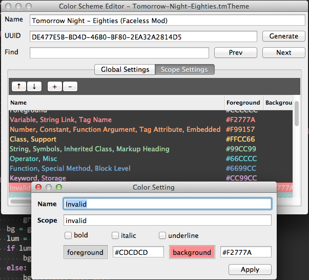
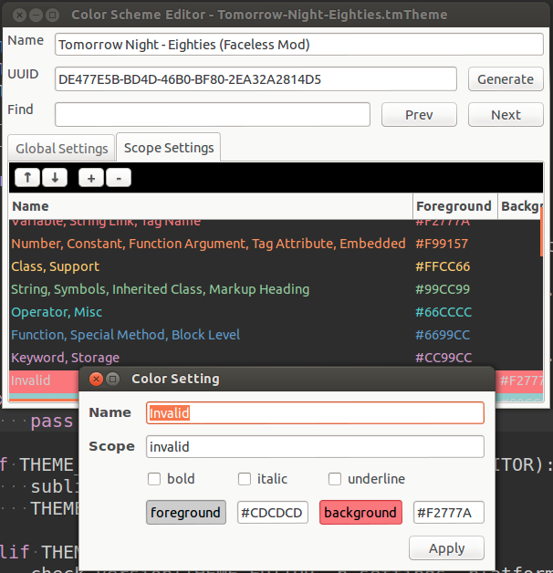

# Sublime Color Scheme Editor

Sublime Color Scheme Editor (subclrschm) is a graphical Sublime Text color scheme editor.  It is cross platform and runs in Windows, macOS, and Linux.

Windows

macOS

Linux

