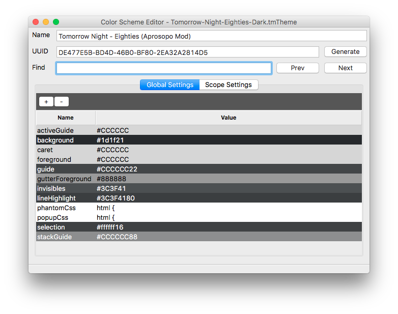
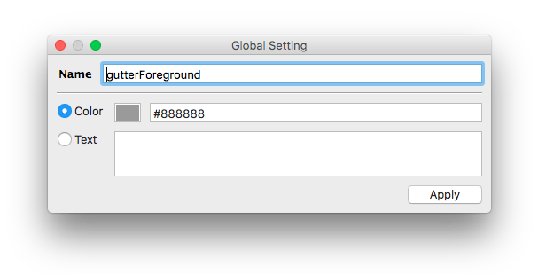
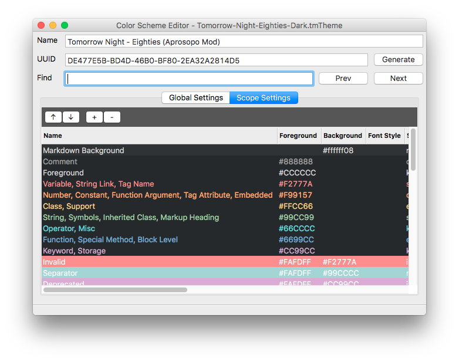
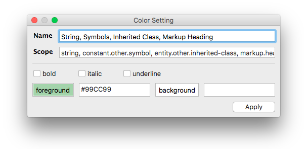

# User Guide

Subclrschm is a simple GUI for editing a Sublime color scheme file (`.tmTheme`). Simply point it at a `tmTheme` file and get editing.

## Command Line

```
Faceless-MacBook-Pro:subclrschm facelessuser$ python3 -m subclrschm --help
usage: subclrschm [-h] [--version] [--multi-instance] [--log [LOG]]
                  [--live_save] [--select | --new]
                  [file]

Sublime Color Scheme Editor - Edit Sublime Color Scheme

positional arguments:
  file                  Theme file

optional arguments:
  -h, --help            show this help message and exit
  --version             show program's version number and exit
  --multi-instance, -m  Allow multiple instances
  --log [LOG], -l [LOG]
                        Absolute path to directory to store log file
  --live-save, -L       Enable live save.
  --select, -s          Prompt for theme selection
  --new, -n             Open prompting for new theme to create
```

Option           | Description
---------------- | -----------
`file`           | Optional positional argument to specify a `tmTheme` file to open.
`multi-instance` | By default, subclrschm will only allow one instance of subclrschm, and if another instance is opened, it will send the arguments to the instance already open. You can allow multiple instances with this setting. Restarting the current instances may be required.
`log`            | Subclrschm will store a log with any errors and such in `~/.subclrschm`, `~/.config/subclrschm`, or `c:\Users\<username>\.subclrschm` in macOS, Linux, and Windows respectively. You can redirect the log placement by pointing this setting at a folder.  This is mainly used for integration in Sublime Text to save log to User folder.
`live-save`      | This saves any changes immediately to the color scheme file. This is mainly used in Sublime Text integration to provide live updates when editing the current, active color scheme.
`select`         | Instead of asking the user if they want to create a new color scheme or open an existing one, you can force it to immediately ask you to select an existing color scheme.  This is used in Sublime Text integration.
`new`            | Instead of asking the user if they want to create a new color scheme or open an existing one, you can force it to create a new color scheme.  This is used in Sublime Text integration.

## Opening/Creating New Color Schemes

When running subclrschm, if a color scheme was not provided on the command line, it will prompt the user to either create a new color scheme or browse for an existing color scheme. You can also open a different color scheme at any time via the menu: `File->Open`.

## Editing

When opening a color scheme, you will be prevented with a GUI containing boxes with the name of the color scheme and the current UUID. Here you can change the name or UUID (UUIDs are carried over from TextMate, but don't do anything in Sublime color schemes).

Underneath the name and UUID boxes is a find box that allows you to search for names, scopes, and values in the color scheme.

Lastly you see a tabbed interface that displays "Global Settings" and "Scope Settings".  Here you can add a new setting, delete  a setting, change the order of settings, change a setting's name, and change a setting's value.

### Global Settings



The Global Settings tab contains all the general, global settings like background, foreground, gutter colors, popup CSS, etc.

You can create new entries by selecting the `+` button or delete entries by selecting an entry and pressing the `-` button.  You can edit an entry by double clicking it or pressing enter if you have one selected.

You can navigate the entries with the arrow keys or by using the mouse.

### Edit Dialog



When editing an entry, the edit dialog will allow you to either insert a string value when the `Text` radio button is selected, or a color value when the color radio button is selected.  When dealing with a color, you will get a color preview as you change the color's hex value, you can also click the color box to bring up your system's color picker (or a generic color picker in the case of Linux).

Transparent colors are allowed and are represented by the following form `#RRGGBBAA`. Color previews will simulate the transparent color by overlaying foreground colors over the rule's background color (defaults to global background if entry does not contain a background or it is simulating that entry's background color).

### Scope Settings



The Scope Settings tab contains all the scope related entries.

You can create new entries by selecting the `+` button or delete entries by selecting an entry and pressing the `-` button.  You can edit an entry by double clicking it or pressing enter if you have one selected.  You can also change the order of the settings by using the arrow buttons, or by pressing ++alt+up++ or ++alt+down++.

You can also change text emphasis by pressing the ++b++, ++i++, or ++u++ key to toggle bold, italic, or underline respectively (underline doesn't do anything in Sublime Text and is more a TextMate option).
You can also navigate the entries with the arrow keys or by using the mouse.

### Edit Scope Dialog



When editing a scope entry, you can change the name and the target scope.

Underneath the name and scope box, you will find checkboxes allowing you to control whether the target scope will be bold, italic, or underlined (underline doesn't do anything in Sublime Text and is more a TextMate option).

Scope dialogs also give you two colors you can set: background and foreground. The associated text box takes colors in the form `#RRGGBBAA` and support an alpha channel.  You can alternatively click the color preview box and use your system's color picker (or a generic color picker in the case of Linux).
